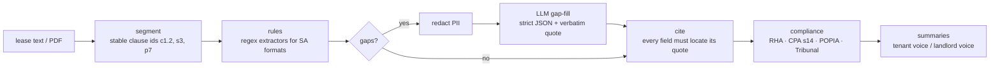

# lease-abstract — residential lease abstraction and SA-law compliance checks, with plain-English summaries for landlord and tenant

[](https://github.com/darrshangovender/lease-abstract/actions/workflows/tests.yml)
[](LICENSE)
[](pyproject.toml)
[](#what-it-checks)

> Feed it a South African residential lease. Get back a typed abstract where every value cites the clause it came from, a list of where the lease falls short of the Rental Housing Act, the Consumer Protection Act and Tribunal practice, and two summaries — one written for the tenant, one for the landlord — that never disagree on a number.

## Why this exists

LeasEase deals with leases that were copied from a template five landlords ago. They say the deposit "will not earn interest", that the landlord "may enter at any time", that the deposit is "forfeited in full on any breach". Each of those is either a breach of the Rental Housing Act or an unfair practice a Rental Housing Tribunal will strike out, and neither party usually knows. This library reads the lease, finds the facts, checks them against the statutes, and explains the result in language a tenant or a landlord can act on — offline, with personal information never leaving the machine.

## Legal disclaimer

This is software, not legal advice. It encodes a reading of the Rental Housing Act 50 of 1999, the Consumer Protection Act 68 of 2008 (s14), the Protection of Personal Information Act 4 of 2013 and common Rental Housing Tribunal unfair-practice rulings. Statute and section are cited on every finding so you can check them. The Rental Housing Amendment Act 35 of 2014 is widely described as being in force; the gazette record still shows its commencement "to be proclaimed", so its rules are reported as **pending_proclamation** and are never counted as violations. For a dispute, speak to an attorney or your provincial Rental Housing Tribunal.

## Quick start

```bash
pip install -e ".[dev]"                       # add [pdf] for pdfplumber-based PDF input

lease-abstract extract demo/leases/01_compliant.txt          # cited abstract (--json for machine output)
lease-abstract check   demo/leases/02_non_interest_deposit.txt --strict   # exit 1 on any in-force violation
lease-abstract summarise demo/leases/04_deposit_forfeit.txt --for tenant  # or --for landlord

python eval/run.py                            # offline benchmark against the gold abstracts
```

```python
from lease_abstract import Pipeline, ComplianceEngine, Summariser

abstract = Pipeline().run(open("lease.txt").read())         # add model=<ModelClient> to gap-fill with an LLM
report = ComplianceEngine().run(abstract)
print(abstract.rent.value.amount_zar, abstract.rent.source_clause_id)   # 8500.0 c4.1
print(Summariser(abstract, report).for_tenant())
```

## How it works



* **Segment** – numbered (`1.`, `1.1`, `(a)`, `1)`), ALL-CAPS and Title-Case headings, page-break noise. Ids are derived from the document so citations survive a re-run.
* **Rules first** – amounts (`R 8 500,00`, `R8500`, `ZAR 8,500.00`), dates (`01/03/2026`, `1 March 2026`, `2026-03-01`), counts (`twenty (20) business days`, `one calendar month`), SA ID numbers (Luhn-checked), company registration numbers.
* **LLM only for gaps** – the model sees redacted clauses, must return strict JSON with a verbatim `extracted_text`, gets one self-correction retry, and any answer whose quote cannot be found in the lease is discarded rather than kept "with low confidence".
* **Cite** – `enforce_citations` blanks any field without a locatable quote. The eval reports this as `cited` and fails if it is not 100%.
* **Compliance** – rules carry `status` (`in_force` / `pending_proclamation`) and CPA rules carry `applicability` (`likely` for a juristic landlord or one letting in the ordinary course of business, otherwise `uncertain`).
* **Summaries** – generated from the same abstract and findings; an optional LLM polish pass is diffed number-for-number and rejected on drift.

## What it checks

| Rule id | What it looks for | Statute and section | Status |
|---|---|---|---|
| `RHA-5-3-D-INTEREST` | Deposit in an interest-bearing account at ≥ savings rate, interest to tenant, proof on request | Rental Housing Act 50/1999 s5(3)(d) | in force |
| `RHA-5-3-E-REFUND` | Refund within 7 days (no damage) / 14 (deductions) / 21 (tenant absent from outgoing inspection) | RHA s5(3)(e)–(g) | in force |
| `RHA-5-3-INSPECTION` | Joint incoming and outgoing inspection | RHA s5(3) | in force |
| `RHAA-2014-INSPECTION-NOTICE` | 24 hours' written notice before entry/inspection | Rental Housing Amendment Act 35/2014 | **pending proclamation** |
| `RHAA-2014-WRITTEN-LEASE` | Lease must be in writing; oral variations not binding | RHAA 35/2014 | **pending proclamation** |
| `CPA-14-CANCELLATION` | Tenant may cancel a fixed term on 20 business days' notice + reasonable penalty | Consumer Protection Act 68/2008 s14(2)(b)(ii), s14(3) | in force (applicability heuristic) |
| `CPA-14-EXPIRY-NOTICE` | Landlord notifies expiry 40–80 business days before end of fixed term | CPA s14(2)(b)(i) | in force (applicability heuristic) |
| `CPA-14-AUTO-RENEWAL` | Fixed term continues month-to-month unless tenant elects otherwise | CPA s14(2)(d) | in force (applicability heuristic) |
| `COMMON-LAW-MONTHLY-NOTICE` | Month-to-month tenancy needs one calendar month's notice | Common law, RHA s13 / s15(1)(f) | in force (unfair practice) |
| `UNFAIR-DEPOSIT-FORFEIT` | Deposit forfeited on any breach | RHA s13(4)–(5), s15(1)(f), Unfair Practice Regulations | in force (unfair practice) |
| `UNFAIR-ENTRY-NO-NOTICE` | Landlord may enter at any time / without notice | RHA s15(1)(f), Unfair Practice Regulations | in force (unfair practice) |
| `UNFAIR-REPAIR-WAIVER` | Tenant waives landlord's duty to maintain a habitable dwelling | RHA s15(1)(f), Unfair Practice Regulations | in force (unfair practice) |
| `UNFAIR-TRIBUNAL-WAIVER` | Tenant waives access to the Rental Housing Tribunal | RHA s13, s15(1)(f) | in force (unfair practice) |
| `UNFAIR-LOCKOUT` | Lock-out, utility disconnection or removal of goods without a court order | RHA s15(1)(f); PIE Act 19/1998 s4, s8 | in force (unfair practice) |
| `POPIA-PII` | Personal information present; lawful purpose documented; redacted before any model call or log | POPIA 4/2013 s9–s11 | in force (advisory) |

## The result

`python eval/run.py` on the six synthetic demo leases (rules only, `MockModel` answering `{}`):

```
lease                            |    fields | field P | field R |  findings |  find P |  find R | pending |   cited
--------------------------------------------------------------------------------------------------------------------
01_compliant.txt                 |  30/30    |  100.0% |  100.0% |   0/0     |  100.0% |  100.0% |      ok | 11/11
02_non_interest_deposit.txt      |  31/31    |  100.0% |  100.0% |   3/3     |  100.0% |  100.0% |      ok | 10/10
03_entry_any_time.txt            |  28/28    |  100.0% |  100.0% |   1/1     |  100.0% |  100.0% |      ok | 11/11
04_deposit_forfeit.txt           |  28/28    |  100.0% |  100.0% |   2/2     |  100.0% |  100.0% |      ok | 11/11
05_juristic_no_cpa.txt           |  27/27    |  100.0% |  100.0% |   3/3     |  100.0% |  100.0% |      ok | 10/10
06_monthly_7day_notice.txt       |  27/27    |  100.0% |  100.0% |   1/1     |  100.0% |  100.0% |      ok | 11/11
--------------------------------------------------------------------------------------------------------------------
TOTAL                            | 171/171   |  100.0% |  100.0% |  10/10    |  100.0% |  100.0% |      ok | 64/64
```

Fields are scored per leaf (`rent.amount_zar`, `term.kind`, …) against hand-written gold in `demo/expected/`; findings are rule ids against `demo/expected_findings.yml`. A perfect score on a corpus the rules were tuned against says the pipeline is consistent, not that it generalises — see Limitations.

## Design decisions

* **No citation, no value.** `Field` carries `source_clause_id` and `extracted_text`; the pipeline drops anything it cannot locate. A wrong-but-cited answer can be checked in seconds; an uncited one cannot.
* **Rules before models.** Deterministic extractors handle the formats SA leases actually use. The LLM is a gap-filler with a one-retry, strict-schema contract, so the offline test suite covers the real path with a `MockModel`.
* **Pending law is structurally separate.** `ComplianceRule.run` re-stamps any finding from a `pending_proclamation` rule as pending, whatever the check returned. `ComplianceReport.violations()` cannot include it; `--strict` cannot fail on it.
* **CPA applicability is surfaced, not assumed.** The Act binds suppliers; whether an individual landlord is one is a question of fact, so the finding says `likely` or `uncertain` instead of pretending to know.
* **POPIA by construction.** ID numbers (Luhn-validated), phone numbers, emails, bank accounts and branch codes become `[ID_1]`-style placeholders before any prompt or log line; the abstract records only `has_id_number`, never the number.
* **Two voices, one truth.** Both summaries are rendered from the same objects; the LLM polish is diffed number-for-number and falls back to the template on any drift.

## Limitations

* The regexes are tuned to the six-lease demo corpus and the heading styles in it. A lease written in a different register (Afrikaans, long-form deeds, tables) will need new rules or the LLM path.
* PDF input relies on `pdfplumber` text extraction; multi-column layouts and scanned images lose structure or fail entirely.
* This is not a Tribunal. Unfair-practice patterns are sentence-level regexes with a small negation list; a clause phrased unusually can be missed or over-flagged.
* CPA applicability is a heuristic (juristic landlord or "ordinary course of business" wording → `likely`), not a legal determination.
* Section references follow the project brief; verify against the gazetted text before relying on a citation in a dispute.

## Project layout

```
lease_abstract/
  segment.py            clause segmenter, categoriser, family_text
  schema.py             Field / LeaseAbstract / Clause (pydantic, extra=forbid)
  privacy.py            Luhn SA-ID check, Redactor, RedactingFilter
  extract/rules.py      amount/date/count finders + field extractors
  extract/llm.py        ModelClient protocol, MockModel, strict-JSON gap-fill
  extract/pipeline.py   segment -> rules -> LLM -> enforce_citations
  compliance/rules.py   ComplianceRule, Finding, pending_proclamation guard
  compliance/sa.py      RHA, RHAA (pending), CPA s14, POPIA, monthly notice
  compliance/tribunal.py unfair-practice patterns
  summary.py            tenant/landlord summaries, number-preserving polish
  cli.py                extract | check | summarise
demo/leases/            six synthetic SA leases (no real people)
demo/expected/          gold abstracts, one JSON per lease
demo/expected_findings.yml
eval/run.py             offline benchmark (the table above)
tests/                  offline test suite
```

## Tests

156 tests, all offline: `pytest tests/ -q`. They cover the segmenter on each heading style, every amount and date format, SA-ID Luhn validation, each compliance rule as a true positive and a true negative, the guarantee that `pending_proclamation` findings never appear as violations, CPA applicability inference, number preservation in both summaries, PII never reaching model prompts, the citation contract on every extracted field, and CLI smoke tests. `ruff check .` passes clean.

## Author

Darrshan Govender · [LeasEase](https://leasease.co.za) · [Agulhas Code](https://agulhascode.co.za) · Durban, South Africa
